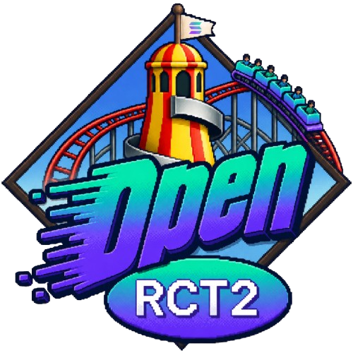

<p align="center">
  
</p>

# OpenRCT2 × Solana City

A Solana on-chain layer for a fork of [OpenRCT2](https://github.com/jaysobel/OpenRCT2)
using **MagicBlock Ephemeral Rollups** — making every guest spend, ride visit,
and venue interaction a real blockchain transaction at ~10-50ms latency.

**Status:** Anchor program deployed and live on **Solana devnet**. ER endpoint runs on
**MagicBlock devnet**. See [Deployed Addresses](#deployed-addresses-devnet) below.

---

## What This Is

When you play the park, every economic event becomes real:

- Guests enter with a **$TYCOON token balance** stored on-chain
- Every ride, food purchase, and ATM withdrawal is a **Solana transaction**
- Revenues accumulate in **venue accounts** visible on-chain
- Random events (ride breakdowns, lucky prizes) use **cryptographically verifiable randomness**
- A **self-scheduling crank** updates the park score every 30 seconds — with no server
- Players earn **milestone badges** and submit scores to a global **leaderboard**, while LPs **stake $TYCOON** on individual venues

---

## Features

### Core

| Feature | Description |
|---------|-------------|
| **Guest accounts** | Each guest gets a PDA (`GuestAccount`) holding their balance and spend history |
| **Venue accounts** | Each ride/shop/facility gets a PDA (`VenueAccount`) accumulating revenue |
| **City state** | One `CityState` PDA tracks park-wide stats (total guests, revenue, score) |
| **NDJSON outbox** | C++ game writes events atomically; sidecar tails the file without blocking gameplay |
| **Chain sidecar** | TypeScript process that watches the outbox and routes transactions to Solana |

### Unique to Solana

#### MagicBlock Ephemeral Rollup (~10-50ms per spend)
Guest spend transactions run on a **delegated ephemeral rollup** — not the base
Solana chain. This means:
- No confirmation latency during gameplay
- Accounts "teleport" to the ER on guest entry, back on exit
- Base layer stays consistent via periodic commits

#### VRF Random Park Events
Uses `ephemeral-vrf-sdk` for **verifiable randomness** — the outcome is provable
on-chain, not just a pseudo-random number the server controls.

Random event table (triggered ~once per guest per visit):

| Roll (0–99) | Event | Effect |
|------------|-------|--------|
| 0–19 | **Ride breakdown** | `venue.is_broken = true` — guests can't use it until repaired |
| 20–49 | Quiet day | Nothing |
| 50–79 | **Lucky guest wins prize** | 50–500 $TYCOON awarded to the guest |
| 80–99 | **Park bonus** | +10 $TYCOON to the current guest |

The breakdown mechanic is meaningful: a ride that breaks earns no revenue until
`repair_venue` is called (by the sidecar or park manager wallet).

#### Crank — Automated Park Tick (no server needed)
A MagicBlock crank automatically runs `auto_park_tick` every **30 seconds** on
the Ephemeral Rollup. No cron job, no cloud function needed. The ER handles it.

The tick:
1. Recalculates **park score** (0–1000) from guest count + revenue
2. Logs the current state on-chain

Score formula: `500 + min(active_guests, 200) + min(revenue / 1M, 300)`

#### On-Chain Repair System
When VRF marks a ride broken, the park must call `repair_venue` to bring it
back online. This creates a real management decision: do you spend sidecar SOL
to repair, or leave it and lose revenue?

---

## Deployed Addresses (Devnet)

The program is live on Solana **devnet** under upgrade authority
`HDDYb8NAzwMVuobJJD4UCYzeFNgSawJ2vJhPMfFLBiLB`. The deployed binary is
byte-identical to the current `programs/solana-city/` source.

### Program

| Account | Address | Notes |
|---|---|---|
| `solana_city` program | `2ce1z7iFfMB6BHzaWvT5jqhsDsS6jeEjvymGYwrb8wDn` | Same ID on localnet/devnet (`Anchor.toml`) |
| Upgrade authority | `HDDYb8NAzwMVuobJJD4UCYzeFNgSawJ2vJhPMfFLBiLB` | Devnet wallet |

### Singleton PDAs (initialized on devnet)

| Account | Address | Seeds |
|---|---|---|
| `$TYCOON` token mint | `7vBp2RpMtfpjexC8z7sWV4nUFHNNskQQBxGrRkfSUYN1` | `["park_mint"]` |
| `$TYCOON` Metaplex metadata | `BFuRata5t9aHjLhz4aFvsqnBH1mGKZcETGDacwRvXLda` | `["metadata", mpl_pid, mint_pubkey]` |
| Leaderboard | `8AqUe5DTaoCBzUZt5ZQLTdH6khBTcyPE8Veo7qk2uTxA` | `["leaderboard"]` |
| City (`park_id=1`) | `CUW5Ea9uSvfppPD5PmLykKzSrLYxysCNwDcLSFk86kq` | `["city", park_id_u32_le]` |

### Per-instance PDA seed reference

All seeds use the program ID `2ce1z7iFfMB6BHzaWvT5jqhsDsS6jeEjvymGYwrb8wDn`.
`u32_le` = 4-byte little-endian.

| PDA | Seeds |
|---|---|
| `CityState` | `["city", park_id_u32_le]` |
| `GuestAccount` | `["guest", park_id_u32_le, guest_id_u32_le]` |
| `VenueAccount` | `["venue", park_id_u32_le, venue_id_u32_le]` |
| `VenueStakeVault` | `["vault", park_id_u32_le, venue_id_u32_le]` |
| `StakePosition` | `["stake", park_id_u32_le, venue_id_u32_le, staker_pubkey]` |
| `Badge` | `["badge", city_pubkey, tier_u8]` |
| `$TYCOON` mint | `["park_mint"]` *(historical seed; display name is TYCOON via Metaplex)* |
| `Leaderboard` | `["leaderboard"]` |

### Endpoints

| Layer | URL |
|---|---|
| Base (Solana devnet) RPC | `https://api.devnet.solana.com` |
| MagicBlock ER RPC | `https://devnet.magicblock.app/` |
| MagicBlock ER WS | `wss://devnet.magicblock.app/` |

---

## Architecture

### High-level data flow

```
┌──────────────────────┐   NDJSON outbox        ┌────────────────────────┐
│ OpenRCT2 (C++ game)  │ ─────────────────────▶ │ chain-sidecar (TS)     │
│  • game loop         │  ~/Library/Application │  • tails outbox        │
│  • robot terminal    │   Support/OpenRCT2/    │  • classifies events   │
│  • rctctl CLI        │   chain-outbox.ndjson  │  • routes to base / ER │
└──────────────────────┘                        └─────────┬──────────────┘
        ▲                                                 │
        │ in-game CLI / agent                             │
        │                                                 ▼
                                            ┌──────────────────────────────┐
                                            │ Solana devnet (base layer)   │
                                            │  • city init, registrations  │
                                            │  • $TYCOON mint + redeem     │
                                            │  • stake / claim_prize       │
                                            │  • leaderboard, badges       │
                                            └─────────┬────────────────────┘
                                                      │ delegate / commit /
                                                      │ undelegate
                                                      ▼
                                            ┌──────────────────────────────┐
                                            │ MagicBlock Ephemeral Rollup  │
                                            │ (devnet.magicblock.app)      │
                                            │  • spend (hot path)          │
                                            │  • request_park_event (VRF)  │
                                            │  • auto_park_tick (crank)    │
                                            └──────────────────────────────┘
```

Guest and venue accounts are created on the base layer, then **delegated to
the ER** for fast gameplay (`spend`, VRF, crank). Periodic `commit_*` syncs
flush state back to devnet; `exit_*` undelegates and returns final state.

### How a guest becomes an on-chain account

Walking through what happens the first time a single guest pays admission and
enters the park, all the way to a live ER-side balance:

1. **In-game trigger.** When a guest transitions from "outside" to "inside
   park", C++ calls
   `OpenRCT2::Scripting::ChainOutbox::Get().EmitGuestEntry(guestId, cashInPocket / 10.0)`
   in `game/src/openrct2/entity/Guest.cpp` (`Guest::UpdateEnteringPark`).

2. **Outbox event.** That writes one line of NDJSON to
   `~/Library/Application Support/OpenRCT2/chain-outbox.ndjson`:

   ```json
   {"kind":"GUEST_ENTRY","seq":42,"ts":1779270440067,"guestId":71,"cash":"60.000000"}
   ```

   The file is append-only and never blocks the game loop.

3. **Sidecar dispatch.** The Node.js sidecar tails the outbox and routes the
   event to `onGuestEntry` in `chain-sidecar/src/solana/delegate.ts`.

4. **PDA derivation & status check.** The sidecar computes the deterministic
   address `findProgramAddress([b"guest", park_id_le, guest_id_le], PROGRAM_ID)`
   and queries the chain to see if it already exists. Three branches:

   - **`missing`** — calls `register_guest(park_id, guest_id, initial_balance)`
     on the Anchor program. That `init`s a `GuestAccount` PDA on base, paid for
     by the sidecar's wallet. Then calls `delegate_guest` to move it to
     MagicBlock's ER.
   - **`base`** — guest exited before and the PDA is back on base. Calls
     `reactivate_guest` (resets balance to fresh pocket cash, flips
     `is_active=true`), then re-delegates to ER.
   - **`delegated`** — already on ER, no-op.

5. **PDA address = "wallet".** The PDA address is what we display as the
   guest's wallet — base58-encoded `findProgramAddress(...)` result. It's NOT a
   real Ed25519 keypair, it's a deterministic program-derived address. The
   in-game Guest detail window (overview tab) shows the truncated address +
   balance from the chain-state snapshot.

6. **Who pays.** The sidecar's hot wallet
   (`HDDYb8NAzwMVuobJJD4UCYzeFNgSawJ2vJhPMfFLBiLB`) is the `payer` and signer
   for ALL guest creation. Guests don't have wallets of their own. The chain
   treats the entire park as operator-owned state. (See the
   [Who pays / EIP-712](#who-pays--session-keys--eip-712-analog) note below
   for the equivalent of Ethereum's session-key / EIP-712 abstractions.)

7. **Balance updates.** While delegated to the ER, every `GUEST_SPEND` event
   triggers `spend(park_id, guest_id, venue_id, amount, category)` on the ER,
   which decrements `guest.balance` and bumps `venue.total_revenue`. That live
   ER state is what `chain-state.json` reads (via `erProgram.fetchMultiple`),
   and what the in-game wallet panels display.

8. **Exit + redemption.** When a guest leaves the park, the sidecar calls
   `exit_guest` (commit + undelegate from ER), then `claim_prize` (settles any
   VRF prize, flips `is_active=false`), then `redeem_balance` — which mints
   real `$TYCOON` SPL tokens worth the remaining balance to the operator's ATA
   and zeros the PDA's internal balance.

**Cost per guest lifecycle:**

| Step | Where | Cost (devnet lamports) |
|------|-------|------------------------|
| `register_guest` (init PDA) | base | ~7,000 |
| `delegate_guest` | base | ~5,000 |
| `spend` × N (during visit) | ER | ~free per tx |
| `exit_guest` (commit + undelegate) | ER | ~5,000 |
| `claim_prize` | base | ~5,000 |
| `redeem_balance` (SPL mint) | base | ~5,000 |

Re-entries are cheaper (just `reactivate_guest` + `delegate_guest` ≈ 10,000
lamports). On Solana mainnet at typical fees, an entire visit costs less than
$0.001 per guest.

### Source tree

```
openrct-solana/
├── game/                       — OpenRCT2 C++ fork (build dir, robot terminal, rctctl)
│   ├── src/openrct2/scripting/rpc/handlers/ChainHandlers.cpp  — chain.status RPC
│   └── src/openrct2/...         — ChainOutbox NDJSON writer wired into Guest/Ride/Game
│
├── programs/solana-city/       — Anchor program (Rust)
│   ├── Cargo.toml              — anchor 0.32.1, ephemeral-rollups-sdk 0.11.1,
│   │                             ephemeral-vrf-sdk 0.2.3, magicblock-magic-program-api 0.8.5
│   └── src/
│       ├── lib.rs              — #[ephemeral] program entry, 30 instructions
│       ├── state.rs            — account types
│       ├── errors.rs           — CityError enum
│       └── instructions/
│           ├── city.rs         — initialize_city, update_park_score
│           ├── guest.rs        — register / delegate / claim_prize / commit / exit
│           ├── venue.rs        — register / delegate / rename / repair / remove / deactivate
│           ├── token.rs        — initialize_park_mint, redeem_balance, create_park_metadata
│           ├── staking.rs      — create_stake_vault, stake, unstake, claim_stake_rewards
│           ├── leaderboard.rs  — initialize_leaderboard, submit_score
│           ├── badges.rs       — claim_badge (milestone tiers)
│           ├── vrf.rs          — request_park_event, consume_park_event, apply_vrf_result
│           └── crank.rs        — schedule_park_crank, auto_park_tick
│
├── chain-sidecar/              — TypeScript event router
│   └── src/
│       ├── main.ts             — dispatcher + city/$TYCOON bootstrap
│       ├── e2e.ts              — devnet end-to-end smoke
│       ├── outbox/             — NDJSON tail reader + event types
│       ├── solana/
│       │   ├── clients.ts      — dual provider: devnet + MagicBlock ER
│       │   ├── accounts.ts     — PDA derivation
│       │   └── delegate.ts     — base ↔ ER transaction builders
│       └── ipc/                — JSON-RPC bridge to the game
│
├── tests/                      — Anchor mocha suite (devnet ER + localnet multi-park)
├── migrations/                 — Anchor deploy scripts
└── Anchor.toml, Cargo.toml     — workspace config
```

### Program instructions (30)

| Module | Instructions |
|---|---|
| `city` | `initialize_city`, `update_park_score` |
| `guest` | `register_guest`, `reactivate_guest`, `delegate_guest`, `spend`, `claim_prize`, `commit_guest`, `exit_guest` |
| `venue` | `register_venue`, `delegate_venue`, `rename_venue`, `repair_venue`, `remove_venue`, `deactivate_venue` |
| `token` | `initialize_park_mint`, `redeem_balance`, `create_park_metadata` |
| `staking` | `create_stake_vault`, `stake`, `unstake`, `claim_stake_rewards` |
| `leaderboard` | `initialize_leaderboard`, `submit_score` |
| `badges` | `claim_badge` |
| `vrf` | `request_park_event`, `consume_park_event`, `apply_vrf_result` |
| `crank` | `schedule_park_crank`, `auto_park_tick` |

### Who pays / session keys / EIP-712 analog

A common question is "where do per-guest signatures fit?". The short answer:
**there are none today** — the entire park is operator-owned state. The
sidecar's hot wallet is the unconditional `payer` and signer for every
instruction. Mapping to Ethereum mental models:

| Ethereum concept | Solana equivalent in this project |
|---|---|
| User wallet signs every action | Operator wallet signs every action (no per-guest signing) |
| `eth_sign` / `personal_sign` raw bytes | `signMessage` via Solana Wallet Standard (unused here) |
| **EIP-712 typed structured data** | No canonical Solana equivalent. Closest: Ed25519 signature verified via `Ed25519SigVerify` syscall (no struct typing, no domain separator) |
| Meta-transactions / gasless relays | Durable nonces + separate fee-payer; both signatures in one tx |
| Permit / approve pattern | PDA delegation + Anchor `constraint = ...` checks |
| **Session keys** (ERC-4337 etc.) | [MagicBlock session keys SDK](https://docs.magicblock.gg/), Gum SDK, or hand-rolled PDA-as-signer with expiry. Not yet wired into this fork |

To make guests truly player-owned (e.g. for a public/multiplayer version)
would require three changes: (1) Phantom or Backpack wallet integration in
the game UI, (2) per-guest `owner: Pubkey` on `GuestAccount` enforced via
`has_one`, (3) a session-key delegation so the sidecar can submit spends
without the player having to sign each one. For the current single-player
demo, the operator-pays model is the right scope — the showcase is "how
cheap and fast MagicBlock ER is", not "how easy player onboarding is".

---

## Getting Started

### Prerequisites

```bash
solana --version   # 2.1+
anchor --version   # 0.32.1
node --version     # 18+
cargo --version    # 1.79+
# macOS game build also needs:
brew install libvterm pkg-config cmake ninja
```

A funded devnet wallet at `~/.config/solana/id.json` (`solana airdrop 2 --url devnet`)
and a Steam/GOG install of RollerCoaster Tycoon 2 (launch once so the assets
land in `~/Library/Application Support/OpenRCT2/`).

### Build everything

```bash
# Anchor program
anchor build                                        # → target/deploy/solana_city.so

# Native game (macOS)
cd game
cmake -S . -B build -G Ninja                        # one-time
cmake --build build --target agent_bundle -j8
cd ..

# Chain sidecar
cd chain-sidecar && npm install && cd ..
```

### Run end-to-end (devnet + MagicBlock devnet ER)

No local validator needed — the program is **already deployed on devnet** at
`2ce1z7iFfMB6BHzaWvT5jqhsDsS6jeEjvymGYwrb8wDn` and the sidecar talks to
MagicBlock's devnet ER directly.

```bash
# Terminal 1 — sidecar (tails the game's NDJSON outbox, routes to devnet + ER)
cd chain-sidecar
npm run dev

# Terminal 2 — game
cd game
./build/OpenRCT2.app/Contents/MacOS/OpenRCT2 \
    --verbose --log-file game-logs/session.log
```

In the game, click the robot icon in the toolbar to open the AI agent terminal
(launches Claude Code if `claude` is on `PATH`, otherwise the bootstrap REPL).

### Environment variables (optional overrides)

All defaults already point at devnet — only set these to override.

```bash
# chain-sidecar/.env
BASE_RPC=https://api.devnet.solana.com
EPHEMERAL_PROVIDER_ENDPOINT=https://devnet.magicblock.app/
EPHEMERAL_WS_ENDPOINT=wss://devnet.magicblock.app/
WALLET_PATH=~/.config/solana/id.json
OUTBOX_PATH=~/Library/Application Support/OpenRCT2/chain-outbox.ndjson
PROGRAM_ID=2ce1z7iFfMB6BHzaWvT5jqhsDsS6jeEjvymGYwrb8wDn
PARK_ID=1
CITY_NAME=Solana City
```

### Tests

```bash
# Anchor program tests against devnet + MagicBlock ER
yarn ts-mocha -p ./tsconfig.json -t 180000 tests/solana-city-er.ts

# Game CLI validation (fast)
cd game/build && ctest -R rctctl_validation

# Full headless E2E
cd game/build && ctest -R agent_scenarios
```

---

## Demo Runbook

Step-by-step for running the live demo end-to-end. Assumes you've already done
the one-time setup (devnet wallet funded, $TYCOON mint + city + leaderboard
initialised — these are no-ops on subsequent runs).

### 1. Launch order

Open two terminals + the game window. Order matters: sidecar should be running
*before* the game starts emitting events, otherwise early events backlog in
the NDJSON file.

```bash
# Terminal A — chain sidecar (event router + score loop + lottery + snapshot)
cd chain-sidecar
LOTTERY_TICK_MS=15000 npm run dev

# Terminal B — open the game from the rebuilt bundle
open game/build/OpenRCT2.app
```

What to verify in Terminal A within ~10 seconds of startup:

```
[chain] Park 1 already initialized on-chain
[chain] $TYCOON mint already initialized
[chain] Leaderboard already initialized: 8AqUe5DTaoCBzUZt5ZQLTdH6khBTcyPE8Veo7qk2uTxA
[chain] Hydrated runtime state: NN active guests, M venues
[chain] Score loop running every 30000ms
[chain] Lottery loop running every 15000ms
[chain] Snapshot writer attached
[chain] Watching outbox...
```

### 2. What's visible in the game

- **Title screen logo** (top-left of the title window): Solana × MagicBlock
  composite, replacing the default OpenRCT2 lighthouse.
- **Bottom-toolbar HUD line** (middle panel, top): `<operator>   [coin]
  <revenue>   Score N   Rank #r / pop   Badges ****`. Live from
  `chain-state.json`; refreshes every 30s.
- **Any money number** (park value, ride prices, guest finance tab): renders
  the inline TYCOON coin glyph instead of `£`.
- **Guest detail window → first tab**: two extra lines below the action label
  showing the guest's PDA address (truncated) + on-chain balance.
- **Ride detail window → first tab**: two extra lines above the status row
  showing the venue PDA address + on-chain revenue + `BROKEN` flag when
  applicable.

### 3. What to point at in the sidecar log

Per-event lines you can highlight live:

| Log line | What's happening |
|---|---|
| `Registering guest 71 in park 1 (60.000000 TYCOON)...` | `register_guest` ix on base — new PDA created |
| `Guest 71 delegated to ER` | `delegate_guest` — PDA now lives on MagicBlock ER |
| `Guest 71 exists on base — reactivating + re-delegating...` | Returning guest, balance reset to fresh pocket cash |
| `[lottery] VRF requested: guest=X venue=Y seed=Z (active=N)` | `request_park_event` ix on ER, oracle callback pending |
| `[chain] VRF result applied for guest X (venue=Y)` | Staged prize transferred from venue to guest before exit |
| `[score] park_score=889 active_guests=89 revenue=437100000 rank=#1/1` | `update_park_score` + `submit_score` round-trip |
| `[badge] Claimed tier 0 (Bronze) — 173 total guests` | Auto-claim crossed threshold |
| `Guest 71 redeemed 70000000 $TYCOON` | `redeem_balance` — SPL mint on exit |

### 4. On-chain verification

Open these in a devnet explorer (Solscan or solana.fm; switch network to
devnet):

- **Program ID**: `2ce1z7iFfMB6BHzaWvT5jqhsDsS6jeEjvymGYwrb8wDn`
- **$TYCOON mint**: derived from `parkMintPda()` — visible in the snapshot
  JSON or copy from the game's About dialog
- **Leaderboard PDA**: `8AqUe5DTaoCBzUZt5ZQLTdH6khBTcyPE8Veo7qk2uTxA`
- **Operator wallet**: `HDDYb8NAzwMVuobJJD4UCYzeFNgSawJ2vJhPMfFLBiLB` — you
  can show its tx history scrolling in real time as the sidecar fires events.
- **Any guest PDA**: open a guest in the game, copy the truncated address
  shown in the wallet panel; paste the full base58 (visible in
  `chain-state.json`) into the explorer to inspect the account data
  (balance, total_spent, is_active, ...).

### 5. Staking demo (off the main loop)

The staking architecture works on a dedicated phantom venue (id=999) that
isn't delegated to the ER. The flow is exercised via the one-shot script:

```bash
cd chain-sidecar
npm run stake-demo            # registers venue 999, creates vault, stakes 0.05 SOL
npm run stake-demo -- status  # prints vault + position state
npm run stake-demo -- claim   # mints any accumulated TYCOON rewards
npm run stake-demo -- unstake # withdraws all staked SOL + claims rewards
```

Each command prints the resulting on-chain state so you can show the vault
PDA / position PDA / lamport balances changing in real time.

(Staking on a *delegated* venue would require redesigning the staking ixs to
operate on the ER side, since the current `Account<'info, VenueAccount>`
constraint requires program-ownership. The phantom-venue path demonstrates
the architecture without that rewrite.)

### 6. VRF lottery moment

The lottery fires every `LOTTERY_TICK_MS` (default 60s; set to 15000 for the
demo). To verify the oracle is actually rolling, in a third terminal:

```bash
cd chain-sidecar && npx ts-node -e "
import { Connection, PublicKey } from '@solana/web3.js';
const c = new Connection(process.env.EPHEMERAL_PROVIDER_ENDPOINT, 'confirmed');
const p = new PublicKey('2ce1z7iFfMB6BHzaWvT5jqhsDsS6jeEjvymGYwrb8wDn');
(async () => {
  const sigs = await c.getSignaturesForAddress(p, { limit: 30 });
  for (const s of sigs.reverse()) {
    const tx = await c.getTransaction(s.signature, { maxSupportedTransactionVersion: 0 });
    const logs = tx?.meta?.logMessages?.filter(l => l.includes('RANDOM EVENT'));
    if (logs?.length) for (const l of logs) console.log(l.replace(/^Program log: /, ''));
  }
})();
"
```

Expect lines like:
```
RANDOM EVENT: Quiet moment. (roll=37)
RANDOM EVENT: Venue 1 broke down! (roll=14)
RANDOM EVENT: Guest 64 wins 430284 PARK! (roll=73) — staged in venue
```

---

## Roadmap

See [FEATURES.md](./FEATURES.md) for the prioritized feature list.
See [CHAIN.md](./CHAIN.md) for the event router contract (outbox event types,
delegation rules, ER routing).
